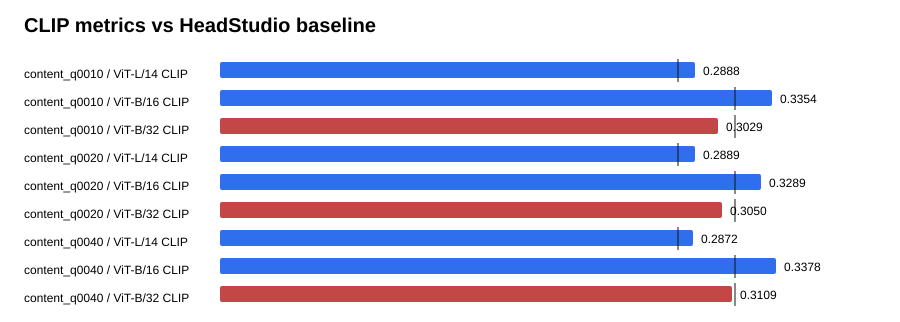

# Text-GS Alignment Dashboard

Baseline is the supplied HeadStudio table. CLIP and MUSIQ are higher-is-better; PIQE is lower-is-better.

## content_q0010

| Metric | Value | Baseline | Delta | Improved |
| --- | ---: | ---: | ---: | :---: |
| ViT-L/14 CLIP | 0.288824 | 0.278400 | 0.010424 | yes |
| ViT-B/16 CLIP | 0.335375 | 0.313000 | 0.022375 | yes |
| ViT-B/32 CLIP | 0.302853 | 0.313100 | -0.010247 | no |
| PIQE | 62.309422 | 59.930000 | 2.379422 | no |
| MUSIQ | 53.899444 | 51.360000 | 2.539444 | yes |

## content_q0020

| Metric | Value | Baseline | Delta | Improved |
| --- | ---: | ---: | ---: | :---: |
| ViT-L/14 CLIP | 0.288860 | 0.278400 | 0.010460 | yes |
| ViT-B/16 CLIP | 0.328856 | 0.313000 | 0.015856 | yes |
| ViT-B/32 CLIP | 0.304970 | 0.313100 | -0.008130 | no |
| PIQE | 62.624196 | 59.930000 | 2.694196 | no |
| MUSIQ | 55.033799 | 51.360000 | 3.673799 | yes |

## content_q0040

| Metric | Value | Baseline | Delta | Improved |
| --- | ---: | ---: | ---: | :---: |
| ViT-L/14 CLIP | 0.287199 | 0.278400 | 0.008799 | yes |
| ViT-B/16 CLIP | 0.337779 | 0.313000 | 0.024779 | yes |
| ViT-B/32 CLIP | 0.310882 | 0.313100 | -0.002218 | no |
| PIQE | 64.685422 | 59.930000 | 4.755422 | no |
| MUSIQ | 54.088773 | 51.360000 | 2.728773 | yes |

## Sources

- `outputs/text_gs_alignment_content_quality_sweep_20260830/content_q0010/eval/all_metrics/summary.json`
- `outputs/text_gs_alignment_content_quality_sweep_20260830/content_q0020/eval/all_metrics/summary.json`
- `outputs/text_gs_alignment_content_quality_sweep_20260830/content_q0040/eval/all_metrics/summary.json`
