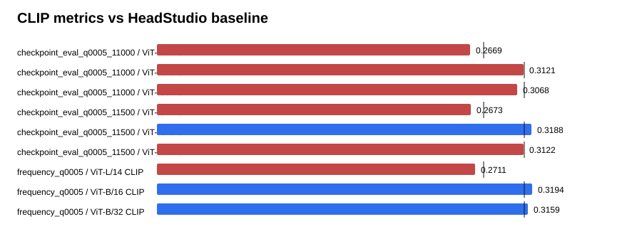

# Text-GS Alignment Dashboard

Baseline is the supplied HeadStudio table. CLIP and MUSIQ are higher-is-better; PIQE is lower-is-better.

## checkpoint_eval_q0005_11000

| Metric | Value | Baseline | Delta | Improved |
| --- | ---: | ---: | ---: | :---: |
| ViT-L/14 CLIP | 0.266876 | 0.278400 | -0.011524 | no |
| ViT-B/16 CLIP | 0.312086 | 0.313000 | -0.000914 | no |
| ViT-B/32 CLIP | 0.306772 | 0.313100 | -0.006328 | no |
| PIQE | 61.366190 | 59.930000 | 1.436190 | no |
| MUSIQ | 56.876076 | 51.360000 | 5.516076 | yes |

## checkpoint_eval_q0005_11500

| Metric | Value | Baseline | Delta | Improved |
| --- | ---: | ---: | ---: | :---: |
| ViT-L/14 CLIP | 0.267341 | 0.278400 | -0.011059 | no |
| ViT-B/16 CLIP | 0.318798 | 0.313000 | 0.005798 | yes |
| ViT-B/32 CLIP | 0.312202 | 0.313100 | -0.000898 | no |
| PIQE | 60.598685 | 59.930000 | 0.668685 | no |
| MUSIQ | 56.230666 | 51.360000 | 4.870666 | yes |

## frequency_q0005

| Metric | Value | Baseline | Delta | Improved |
| --- | ---: | ---: | ---: | :---: |
| ViT-L/14 CLIP | 0.271067 | 0.278400 | -0.007333 | no |
| ViT-B/16 CLIP | 0.319440 | 0.313000 | 0.006440 | yes |
| ViT-B/32 CLIP | 0.315881 | 0.313100 | 0.002781 | yes |
| PIQE | 61.998288 | 59.930000 | 2.068288 | no |
| MUSIQ | 56.573508 | 51.360000 | 5.213508 | yes |

## Sources

- `outputs/text_gs_alignment_frequency_quality_sweep_20260830/checkpoint_eval_q0005_11000/eval/all_metrics/summary.json`
- `outputs/text_gs_alignment_frequency_quality_sweep_20260830/checkpoint_eval_q0005_11500/eval/all_metrics/summary.json`
- `outputs/text_gs_alignment_frequency_quality_sweep_20260830/frequency_q0005/eval/all_metrics/summary.json`
