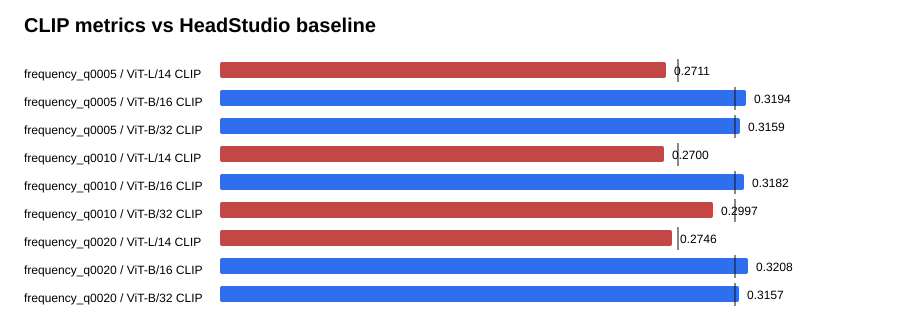

# Text-GS Alignment Dashboard

Baseline is the supplied HeadStudio table. CLIP and MUSIQ are higher-is-better; PIQE is lower-is-better.

## frequency_q0005

| Metric | Value | Baseline | Delta | Improved |
| --- | ---: | ---: | ---: | :---: |
| ViT-L/14 CLIP | 0.271067 | 0.278400 | -0.007333 | no |
| ViT-B/16 CLIP | 0.319440 | 0.313000 | 0.006440 | yes |
| ViT-B/32 CLIP | 0.315881 | 0.313100 | 0.002781 | yes |
| PIQE | 61.998288 | 59.930000 | 2.068288 | no |
| MUSIQ | 56.573508 | 51.360000 | 5.213508 | yes |

## frequency_q0010

| Metric | Value | Baseline | Delta | Improved |
| --- | ---: | ---: | ---: | :---: |
| ViT-L/14 CLIP | 0.270004 | 0.278400 | -0.008396 | no |
| ViT-B/16 CLIP | 0.318233 | 0.313000 | 0.005233 | yes |
| ViT-B/32 CLIP | 0.299741 | 0.313100 | -0.013359 | no |
| PIQE | 63.901771 | 59.930000 | 3.971771 | no |
| MUSIQ | 56.444856 | 51.360000 | 5.084856 | yes |

## frequency_q0020

| Metric | Value | Baseline | Delta | Improved |
| --- | ---: | ---: | ---: | :---: |
| ViT-L/14 CLIP | 0.274647 | 0.278400 | -0.003753 | no |
| ViT-B/16 CLIP | 0.320800 | 0.313000 | 0.007800 | yes |
| ViT-B/32 CLIP | 0.315701 | 0.313100 | 0.002601 | yes |
| PIQE | 62.982658 | 59.930000 | 3.052658 | no |
| MUSIQ | 56.450035 | 51.360000 | 5.090035 | yes |

## Sources

- `outputs/text_gs_alignment_frequency_quality_sweep_20260830/frequency_q0005/eval/all_metrics/summary.json`
- `outputs/text_gs_alignment_frequency_quality_sweep_20260830/frequency_q0010/eval/all_metrics/summary.json`
- `outputs/text_gs_alignment_frequency_quality_sweep_20260830/frequency_q0020/eval/all_metrics/summary.json`
