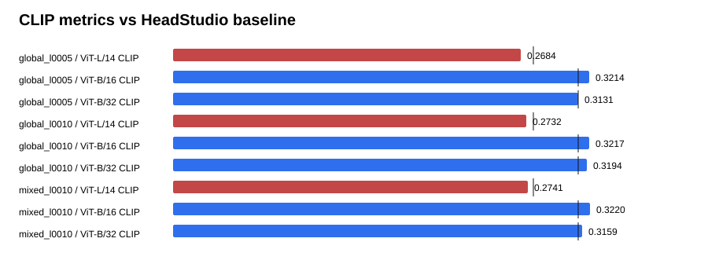

# Text-GS Alignment Dashboard

Baseline is the supplied HeadStudio table. CLIP and MUSIQ are higher-is-better; PIQE is lower-is-better.

## global_l0005

| Metric | Value | Baseline | Delta | Improved |
| --- | ---: | ---: | ---: | :---: |
| ViT-L/14 CLIP | 0.268430 | 0.278400 | -0.009970 | no |
| ViT-B/16 CLIP | 0.321448 | 0.313000 | 0.008448 | yes |
| ViT-B/32 CLIP | 0.313147 | 0.313100 | 0.000047 | yes |
| PIQE | 62.517246 | 59.930000 | 2.587246 | no |
| MUSIQ | 55.880399 | 51.360000 | 4.520399 | yes |

## global_l0010

| Metric | Value | Baseline | Delta | Improved |
| --- | ---: | ---: | ---: | :---: |
| ViT-L/14 CLIP | 0.273201 | 0.278400 | -0.005199 | no |
| ViT-B/16 CLIP | 0.321723 | 0.313000 | 0.008723 | yes |
| ViT-B/32 CLIP | 0.319443 | 0.313100 | 0.006343 | yes |
| PIQE | 62.947541 | 59.930000 | 3.017541 | no |
| MUSIQ | 56.298323 | 51.360000 | 4.938323 | yes |

## mixed_l0010

| Metric | Value | Baseline | Delta | Improved |
| --- | ---: | ---: | ---: | :---: |
| ViT-L/14 CLIP | 0.274077 | 0.278400 | -0.004323 | no |
| ViT-B/16 CLIP | 0.322018 | 0.313000 | 0.009018 | yes |
| ViT-B/32 CLIP | 0.315927 | 0.313100 | 0.002827 | yes |
| PIQE | 62.359344 | 59.930000 | 2.429344 | no |
| MUSIQ | 55.395778 | 51.360000 | 4.035778 | yes |

## Sources

- `outputs/text_gs_alignment_global_recovery_sweep_20260830/global_l0005/eval/all_metrics/summary.json`
- `outputs/text_gs_alignment_global_recovery_sweep_20260830/global_l0010/eval/all_metrics/summary.json`
- `outputs/text_gs_alignment_global_recovery_sweep_20260830/mixed_l0010/eval/all_metrics/summary.json`
