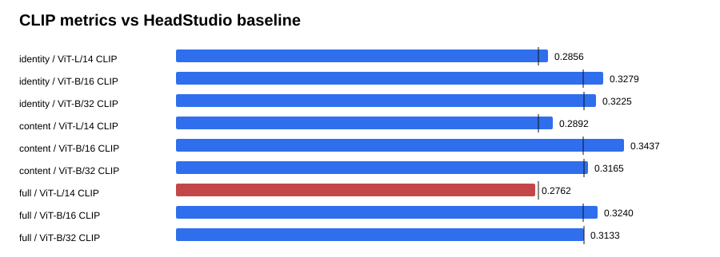

# Text-GS Alignment Dashboard

Baseline is the supplied HeadStudio table. CLIP and MUSIQ are higher-is-better; PIQE is lower-is-better.

## content

| Metric | Value | Baseline | Delta | Improved |
| --- | ---: | ---: | ---: | :---: |
| ViT-L/14 CLIP | 0.289189 | 0.278400 | 0.010789 | yes |
| ViT-B/16 CLIP | 0.343709 | 0.313000 | 0.030709 | yes |
| ViT-B/32 CLIP | 0.316544 | 0.313100 | 0.003444 | yes |
| PIQE | 62.903001 | 59.930000 | 2.973001 | no |
| MUSIQ | 55.577168 | 51.360000 | 4.217168 | yes |

## full

| Metric | Value | Baseline | Delta | Improved |
| --- | ---: | ---: | ---: | :---: |
| ViT-L/14 CLIP | 0.276166 | 0.278400 | -0.002234 | no |
| ViT-B/16 CLIP | 0.324031 | 0.313000 | 0.011031 | yes |
| ViT-B/32 CLIP | 0.313305 | 0.313100 | 0.000205 | yes |
| PIQE | 61.410410 | 59.930000 | 1.480410 | no |
| MUSIQ | 56.379683 | 51.360000 | 5.019683 | yes |

## identity

| Metric | Value | Baseline | Delta | Improved |
| --- | ---: | ---: | ---: | :---: |
| ViT-L/14 CLIP | 0.285566 | 0.278400 | 0.007166 | yes |
| ViT-B/16 CLIP | 0.327941 | 0.313000 | 0.014941 | yes |
| ViT-B/32 CLIP | 0.322520 | 0.313100 | 0.009420 | yes |
| PIQE | 65.748740 | 59.930000 | 5.818740 | no |
| MUSIQ | 56.947380 | 51.360000 | 5.587380 | yes |

## Sources

- `outputs/text_gs_alignment_prompt_factorization_sweep_20260830/identity/eval/all_metrics/summary.json`
- `outputs/text_gs_alignment_prompt_factorization_sweep_20260830/content/eval/all_metrics/summary.json`
- `outputs/text_gs_alignment_prompt_factorization_sweep_20260830/full/eval/all_metrics/summary.json`
