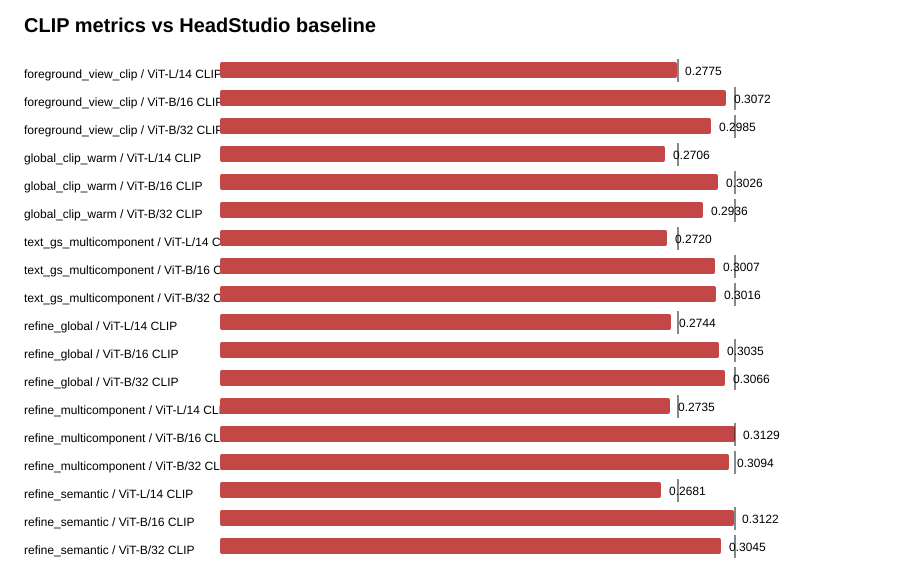

# Text-GS Alignment Dashboard

Baseline is the supplied HeadStudio table. CLIP and MUSIQ are higher-is-better; PIQE is lower-is-better.

## foreground_view_clip

| Metric | Value | Baseline | Delta | Improved |
| --- | ---: | ---: | ---: | :---: |
| ViT-L/14 CLIP | 0.277507 | 0.278400 | -0.000893 | no |
| ViT-B/16 CLIP | 0.307239 | 0.313000 | -0.005761 | no |
| ViT-B/32 CLIP | 0.298511 | 0.313100 | -0.014589 | no |
| PIQE | 68.591249 | 59.930000 | 8.661249 | no |
| MUSIQ | 54.452843 | 51.360000 | 3.092843 | yes |

## global_clip_warm

| Metric | Value | Baseline | Delta | Improved |
| --- | ---: | ---: | ---: | :---: |
| ViT-L/14 CLIP | 0.270631 | 0.278400 | -0.007769 | no |
| ViT-B/16 CLIP | 0.302638 | 0.313000 | -0.010362 | no |
| ViT-B/32 CLIP | 0.293552 | 0.313100 | -0.019548 | no |
| PIQE | 69.448099 | 59.930000 | 9.518099 | no |
| MUSIQ | 55.540452 | 51.360000 | 4.180452 | yes |

## refine_global

| Metric | Value | Baseline | Delta | Improved |
| --- | ---: | ---: | ---: | :---: |
| ViT-L/14 CLIP | 0.274353 | 0.278400 | -0.004047 | no |
| ViT-B/16 CLIP | 0.303470 | 0.313000 | -0.009530 | no |
| ViT-B/32 CLIP | 0.306624 | 0.313100 | -0.006476 | no |
| PIQE | 64.574665 | 59.930000 | 4.644665 | no |
| MUSIQ | 55.785665 | 51.360000 | 4.425665 | yes |

## refine_multicomponent

| Metric | Value | Baseline | Delta | Improved |
| --- | ---: | ---: | ---: | :---: |
| ViT-L/14 CLIP | 0.273504 | 0.278400 | -0.004896 | no |
| ViT-B/16 CLIP | 0.312926 | 0.313000 | -0.000074 | no |
| ViT-B/32 CLIP | 0.309419 | 0.313100 | -0.003681 | no |
| PIQE | 65.032274 | 59.930000 | 5.102274 | no |
| MUSIQ | 57.048752 | 51.360000 | 5.688752 | yes |

## refine_semantic

| Metric | Value | Baseline | Delta | Improved |
| --- | ---: | ---: | ---: | :---: |
| ViT-L/14 CLIP | 0.268077 | 0.278400 | -0.010323 | no |
| ViT-B/16 CLIP | 0.312228 | 0.313000 | -0.000772 | no |
| ViT-B/32 CLIP | 0.304467 | 0.313100 | -0.008633 | no |
| PIQE | 64.750737 | 59.930000 | 4.820737 | no |
| MUSIQ | 56.273251 | 51.360000 | 4.913251 | yes |

## text_gs_multicomponent

| Metric | Value | Baseline | Delta | Improved |
| --- | ---: | ---: | ---: | :---: |
| ViT-L/14 CLIP | 0.271995 | 0.278400 | -0.006405 | no |
| ViT-B/16 CLIP | 0.300687 | 0.313000 | -0.012313 | no |
| ViT-B/32 CLIP | 0.301576 | 0.313100 | -0.011524 | no |
| PIQE | 67.922038 | 59.930000 | 7.992038 | no |
| MUSIQ | 55.929020 | 51.360000 | 4.569020 | yes |

## Sources

- `outputs/text_gs_alignment_20260827/foreground_view_clip/eval/all_metrics/summary.json`
- `outputs/text_gs_alignment_20260827/global_clip_warm/eval/all_metrics/summary.json`
- `outputs/text_gs_alignment_20260827/text_gs_multicomponent/eval/all_metrics/summary.json`
- `outputs/text_gs_alignment_refine_20260828/refine_global/eval/all_metrics/summary.json`
- `outputs/text_gs_alignment_refine_20260828/refine_multicomponent/eval/all_metrics/summary.json`
- `outputs/text_gs_alignment_refine_20260828/refine_semantic/eval/all_metrics/summary.json`
