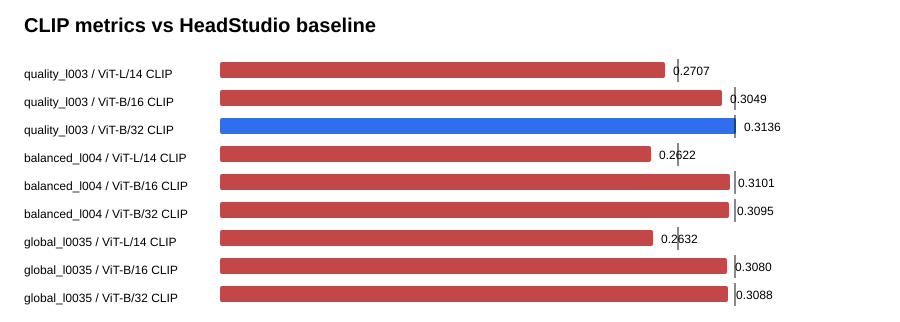

# Text-GS Alignment Dashboard

Baseline is the supplied HeadStudio table. CLIP and MUSIQ are higher-is-better; PIQE is lower-is-better.

## balanced_l004

| Metric | Value | Baseline | Delta | Improved |
| --- | ---: | ---: | ---: | :---: |
| ViT-L/14 CLIP | 0.262153 | 0.278400 | -0.016247 | no |
| ViT-B/16 CLIP | 0.310138 | 0.313000 | -0.002862 | no |
| ViT-B/32 CLIP | 0.309459 | 0.313100 | -0.003641 | no |
| PIQE | 65.732342 | 59.930000 | 5.802342 | no |
| MUSIQ | 54.653815 | 51.360000 | 3.293815 | yes |

## global_l0035

| Metric | Value | Baseline | Delta | Improved |
| --- | ---: | ---: | ---: | :---: |
| ViT-L/14 CLIP | 0.263218 | 0.278400 | -0.015182 | no |
| ViT-B/16 CLIP | 0.308012 | 0.313000 | -0.004988 | no |
| ViT-B/32 CLIP | 0.308804 | 0.313100 | -0.004296 | no |
| PIQE | 64.660643 | 59.930000 | 4.730643 | no |
| MUSIQ | 54.860821 | 51.360000 | 3.500821 | yes |

## quality_l003

| Metric | Value | Baseline | Delta | Improved |
| --- | ---: | ---: | ---: | :---: |
| ViT-L/14 CLIP | 0.270719 | 0.278400 | -0.007681 | no |
| ViT-B/16 CLIP | 0.304899 | 0.313000 | -0.008101 | no |
| ViT-B/32 CLIP | 0.313624 | 0.313100 | 0.000524 | yes |
| PIQE | 65.130355 | 59.930000 | 5.200355 | no |
| MUSIQ | 55.196145 | 51.360000 | 3.836145 | yes |

## Sources

- `outputs/text_gs_alignment_refine_alpha_sweep_20260830/quality_l003/eval/all_metrics/summary.json`
- `outputs/text_gs_alignment_refine_alpha_sweep_20260830/balanced_l004/eval/all_metrics/summary.json`
- `outputs/text_gs_alignment_refine_alpha_sweep_20260830/global_l0035/eval/all_metrics/summary.json`
