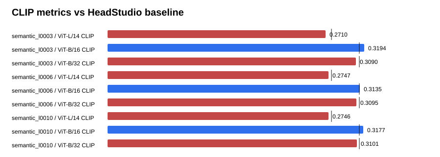

# Text-GS Alignment Dashboard

Baseline is the supplied HeadStudio table. CLIP and MUSIQ are higher-is-better; PIQE is lower-is-better.

## semantic_l0003

| Metric | Value | Baseline | Delta | Improved |
| --- | ---: | ---: | ---: | :---: |
| ViT-L/14 CLIP | 0.271005 | 0.278400 | -0.007395 | no |
| ViT-B/16 CLIP | 0.319354 | 0.313000 | 0.006354 | yes |
| ViT-B/32 CLIP | 0.309028 | 0.313100 | -0.004072 | no |
| PIQE | 64.282049 | 59.930000 | 4.352049 | no |
| MUSIQ | 56.483161 | 51.360000 | 5.123161 | yes |

## semantic_l0006

| Metric | Value | Baseline | Delta | Improved |
| --- | ---: | ---: | ---: | :---: |
| ViT-L/14 CLIP | 0.274738 | 0.278400 | -0.003662 | no |
| ViT-B/16 CLIP | 0.313507 | 0.313000 | 0.000507 | yes |
| ViT-B/32 CLIP | 0.309509 | 0.313100 | -0.003591 | no |
| PIQE | 62.724339 | 59.930000 | 2.794339 | no |
| MUSIQ | 55.834595 | 51.360000 | 4.474595 | yes |

## semantic_l0010

| Metric | Value | Baseline | Delta | Improved |
| --- | ---: | ---: | ---: | :---: |
| ViT-L/14 CLIP | 0.274554 | 0.278400 | -0.003846 | no |
| ViT-B/16 CLIP | 0.317739 | 0.313000 | 0.004739 | yes |
| ViT-B/32 CLIP | 0.310083 | 0.313100 | -0.003017 | no |
| PIQE | 61.862961 | 59.930000 | 1.932961 | no |
| MUSIQ | 56.447023 | 51.360000 | 5.087023 | yes |

## Sources

- `outputs/text_gs_alignment_semantic_quality_sweep_20260830/semantic_l0003/eval/all_metrics/summary.json`
- `outputs/text_gs_alignment_semantic_quality_sweep_20260830/semantic_l0006/eval/all_metrics/summary.json`
- `outputs/text_gs_alignment_semantic_quality_sweep_20260830/semantic_l0010/eval/all_metrics/summary.json`
