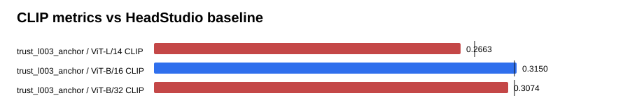

# Text-GS Alignment Dashboard

Baseline is the supplied HeadStudio table. CLIP and MUSIQ are higher-is-better; PIQE is lower-is-better.

## trust_l003_anchor

| Metric | Value | Baseline | Delta | Improved |
| --- | ---: | ---: | ---: | :---: |
| ViT-L/14 CLIP | 0.266277 | 0.278400 | -0.012123 | no |
| ViT-B/16 CLIP | 0.315043 | 0.313000 | 0.002043 | yes |
| ViT-B/32 CLIP | 0.307351 | 0.313100 | -0.005749 | no |
| PIQE | 66.427173 | 59.930000 | 6.497173 | no |
| MUSIQ | 55.959326 | 51.360000 | 4.599326 | yes |

## Sources

- `outputs/text_gs_alignment_trust_region_20260830/trust_l003_anchor/eval/all_metrics/summary.json`
