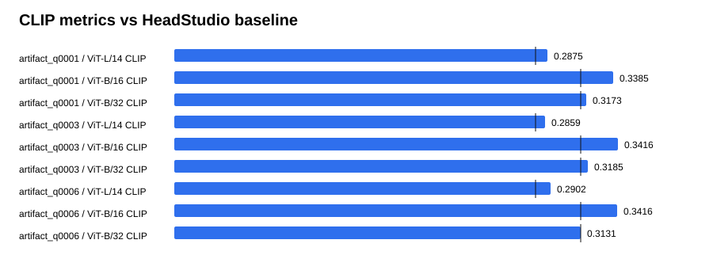

# Text-GS Alignment Dashboard

Baseline is the supplied HeadStudio table. CLIP and MUSIQ are higher-is-better; PIQE is lower-is-better.

## artifact_q0001

| Metric | Value | Baseline | Delta | Improved |
| --- | ---: | ---: | ---: | :---: |
| ViT-L/14 CLIP | 0.287502 | 0.278400 | 0.009102 | yes |
| ViT-B/16 CLIP | 0.338545 | 0.313000 | 0.025545 | yes |
| ViT-B/32 CLIP | 0.317347 | 0.313100 | 0.004247 | yes |
| PIQE | 60.425517 | 59.930000 | 0.495517 | no |
| MUSIQ | 55.875403 | 51.360000 | 4.515403 | yes |

## artifact_q0003

| Metric | Value | Baseline | Delta | Improved |
| --- | ---: | ---: | ---: | :---: |
| ViT-L/14 CLIP | 0.285901 | 0.278400 | 0.007501 | yes |
| ViT-B/16 CLIP | 0.341617 | 0.313000 | 0.028617 | yes |
| ViT-B/32 CLIP | 0.318511 | 0.313100 | 0.005411 | yes |
| PIQE | 62.730646 | 59.930000 | 2.800646 | no |
| MUSIQ | 54.885330 | 51.360000 | 3.525330 | yes |

## artifact_q0006

| Metric | Value | Baseline | Delta | Improved |
| --- | ---: | ---: | ---: | :---: |
| ViT-L/14 CLIP | 0.290199 | 0.278400 | 0.011799 | yes |
| ViT-B/16 CLIP | 0.341607 | 0.313000 | 0.028607 | yes |
| ViT-B/32 CLIP | 0.313116 | 0.313100 | 0.000016 | yes |
| PIQE | 59.550065 | 59.930000 | -0.379935 | yes |
| MUSIQ | 55.631661 | 51.360000 | 4.271661 | yes |

## Sources

- `outputs/text_gs_artifact_quality_sweep_20260830/artifact_q0001/eval/all_metrics/summary.json`
- `outputs/text_gs_artifact_quality_sweep_20260830/artifact_q0003/eval/all_metrics/summary.json`
- `outputs/text_gs_artifact_quality_sweep_20260830/artifact_q0006/eval/all_metrics/summary.json`
