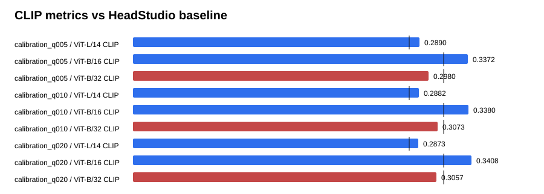

# Text-GS Alignment Dashboard

Baseline is the supplied HeadStudio table. CLIP and MUSIQ are higher-is-better; PIQE is lower-is-better.

## calibration_q005

| Metric | Value | Baseline | Delta | Improved |
| --- | ---: | ---: | ---: | :---: |
| ViT-L/14 CLIP | 0.288989 | 0.278400 | 0.010589 | yes |
| ViT-B/16 CLIP | 0.337208 | 0.313000 | 0.024208 | yes |
| ViT-B/32 CLIP | 0.298028 | 0.313100 | -0.015072 | no |
| PIQE | 63.354777 | 59.930000 | 3.424777 | no |
| MUSIQ | 53.725456 | 51.360000 | 2.365456 | yes |

## calibration_q010

| Metric | Value | Baseline | Delta | Improved |
| --- | ---: | ---: | ---: | :---: |
| ViT-L/14 CLIP | 0.288236 | 0.278400 | 0.009836 | yes |
| ViT-B/16 CLIP | 0.338016 | 0.313000 | 0.025016 | yes |
| ViT-B/32 CLIP | 0.307319 | 0.313100 | -0.005781 | no |
| PIQE | 63.591640 | 59.930000 | 3.661640 | no |
| MUSIQ | 53.705855 | 51.360000 | 2.345855 | yes |

## calibration_q020

| Metric | Value | Baseline | Delta | Improved |
| --- | ---: | ---: | ---: | :---: |
| ViT-L/14 CLIP | 0.287298 | 0.278400 | 0.008898 | yes |
| ViT-B/16 CLIP | 0.340838 | 0.313000 | 0.027838 | yes |
| ViT-B/32 CLIP | 0.305734 | 0.313100 | -0.007366 | no |
| PIQE | 62.199286 | 59.930000 | 2.269286 | no |
| MUSIQ | 54.546177 | 51.360000 | 3.186177 | yes |

## Sources

- `outputs/text_gs_b32_calibration_sweep_20260830/calibration_q005/eval/all_metrics/summary.json`
- `outputs/text_gs_b32_calibration_sweep_20260830/calibration_q010/eval/all_metrics/summary.json`
- `outputs/text_gs_b32_calibration_sweep_20260830/calibration_q020/eval/all_metrics/summary.json`
