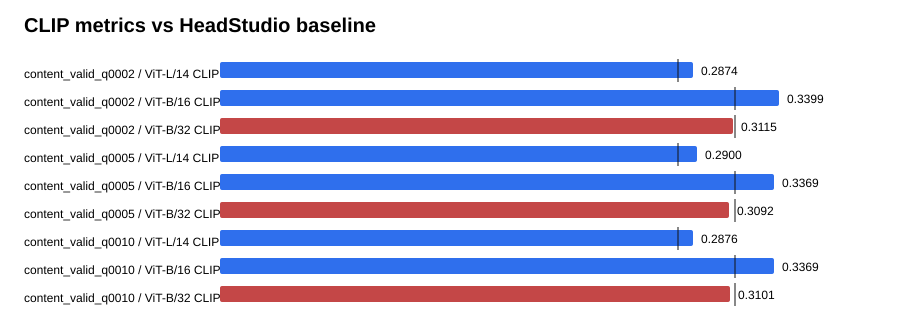

# Text-GS Alignment Dashboard

Baseline is the supplied HeadStudio table. CLIP and MUSIQ are higher-is-better; PIQE is lower-is-better.

## content_valid_q0002

| Metric | Value | Baseline | Delta | Improved |
| --- | ---: | ---: | ---: | :---: |
| ViT-L/14 CLIP | 0.287430 | 0.278400 | 0.009030 | yes |
| ViT-B/16 CLIP | 0.339916 | 0.313000 | 0.026916 | yes |
| ViT-B/32 CLIP | 0.311484 | 0.313100 | -0.001616 | no |
| PIQE | 63.099900 | 59.930000 | 3.169900 | no |
| MUSIQ | 54.267580 | 51.360000 | 2.907580 | yes |

## content_valid_q0005

| Metric | Value | Baseline | Delta | Improved |
| --- | ---: | ---: | ---: | :---: |
| ViT-L/14 CLIP | 0.289982 | 0.278400 | 0.011582 | yes |
| ViT-B/16 CLIP | 0.336910 | 0.313000 | 0.023910 | yes |
| ViT-B/32 CLIP | 0.309158 | 0.313100 | -0.003942 | no |
| PIQE | 62.922252 | 59.930000 | 2.992252 | no |
| MUSIQ | 54.429206 | 51.360000 | 3.069206 | yes |

## content_valid_q0010

| Metric | Value | Baseline | Delta | Improved |
| --- | ---: | ---: | ---: | :---: |
| ViT-L/14 CLIP | 0.287607 | 0.278400 | 0.009207 | yes |
| ViT-B/16 CLIP | 0.336949 | 0.313000 | 0.023949 | yes |
| ViT-B/32 CLIP | 0.310140 | 0.313100 | -0.002960 | no |
| PIQE | 61.468688 | 59.930000 | 1.538688 | no |
| MUSIQ | 53.275495 | 51.360000 | 1.915495 | yes |

## Sources

- `outputs/text_gs_b32_content_valid_sweep_20260830/content_valid_q0002/eval/all_metrics/summary.json`
- `outputs/text_gs_b32_content_valid_sweep_20260830/content_valid_q0005/eval/all_metrics/summary.json`
- `outputs/text_gs_b32_content_valid_sweep_20260830/content_valid_q0010/eval/all_metrics/summary.json`
