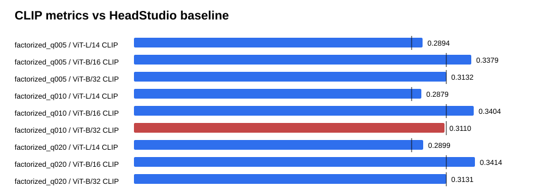

# Text-GS Alignment Dashboard

Baseline is the supplied HeadStudio table. CLIP and MUSIQ are higher-is-better; PIQE is lower-is-better.

## factorized_q005

| Metric | Value | Baseline | Delta | Improved |
| --- | ---: | ---: | ---: | :---: |
| ViT-L/14 CLIP | 0.289407 | 0.278400 | 0.011007 | yes |
| ViT-B/16 CLIP | 0.337941 | 0.313000 | 0.024941 | yes |
| ViT-B/32 CLIP | 0.313192 | 0.313100 | 0.000092 | yes |
| PIQE | 62.309931 | 59.930000 | 2.379931 | no |
| MUSIQ | 54.562886 | 51.360000 | 3.202886 | yes |

## factorized_q010

| Metric | Value | Baseline | Delta | Improved |
| --- | ---: | ---: | ---: | :---: |
| ViT-L/14 CLIP | 0.287853 | 0.278400 | 0.009453 | yes |
| ViT-B/16 CLIP | 0.340441 | 0.313000 | 0.027441 | yes |
| ViT-B/32 CLIP | 0.310951 | 0.313100 | -0.002149 | no |
| PIQE | 64.140808 | 59.930000 | 4.210808 | no |
| MUSIQ | 54.872063 | 51.360000 | 3.512063 | yes |

## factorized_q020

| Metric | Value | Baseline | Delta | Improved |
| --- | ---: | ---: | ---: | :---: |
| ViT-L/14 CLIP | 0.289943 | 0.278400 | 0.011543 | yes |
| ViT-B/16 CLIP | 0.341427 | 0.313000 | 0.028427 | yes |
| ViT-B/32 CLIP | 0.313122 | 0.313100 | 0.000022 | yes |
| PIQE | 61.982813 | 59.930000 | 2.052813 | no |
| MUSIQ | 55.779245 | 51.360000 | 4.419245 | yes |

## Sources

- `outputs/text_gs_b32_factorized_content_calibration_20260830/factorized_q005/eval/all_metrics/summary.json`
- `outputs/text_gs_b32_factorized_content_calibration_20260830/factorized_q010/eval/all_metrics/summary.json`
- `outputs/text_gs_b32_factorized_content_calibration_20260830/factorized_q020/eval/all_metrics/summary.json`
