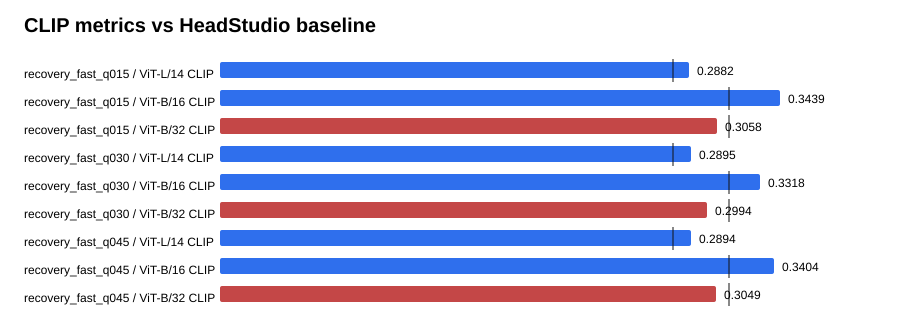

# Text-GS Alignment Dashboard

Baseline is the supplied HeadStudio table. CLIP and MUSIQ are higher-is-better; PIQE is lower-is-better.

## recovery_fast_q015

| Metric | Value | Baseline | Delta | Improved |
| --- | ---: | ---: | ---: | :---: |
| ViT-L/14 CLIP | 0.288185 | 0.278400 | 0.009785 | yes |
| ViT-B/16 CLIP | 0.343947 | 0.313000 | 0.030947 | yes |
| ViT-B/32 CLIP | 0.305845 | 0.313100 | -0.007255 | no |
| PIQE | 62.075521 | 59.930000 | 2.145521 | no |
| MUSIQ | 53.793602 | 51.360000 | 2.433602 | yes |

## recovery_fast_q030

| Metric | Value | Baseline | Delta | Improved |
| --- | ---: | ---: | ---: | :---: |
| ViT-L/14 CLIP | 0.289464 | 0.278400 | 0.011064 | yes |
| ViT-B/16 CLIP | 0.331806 | 0.313000 | 0.018806 | yes |
| ViT-B/32 CLIP | 0.299432 | 0.313100 | -0.013668 | no |
| PIQE | 63.570331 | 59.930000 | 3.640331 | no |
| MUSIQ | 53.150425 | 51.360000 | 1.790425 | yes |

## recovery_fast_q045

| Metric | Value | Baseline | Delta | Improved |
| --- | ---: | ---: | ---: | :---: |
| ViT-L/14 CLIP | 0.289364 | 0.278400 | 0.010964 | yes |
| ViT-B/16 CLIP | 0.340412 | 0.313000 | 0.027412 | yes |
| ViT-B/32 CLIP | 0.304893 | 0.313100 | -0.008207 | no |
| PIQE | 61.925814 | 59.930000 | 1.995814 | no |
| MUSIQ | 54.776586 | 51.360000 | 3.416586 | yes |

## Sources

- `outputs/text_gs_b32_recovery_fast_sweep_20260830/recovery_fast_q015/eval/all_metrics/summary.json`
- `outputs/text_gs_b32_recovery_fast_sweep_20260830/recovery_fast_q030/eval/all_metrics/summary.json`
- `outputs/text_gs_b32_recovery_fast_sweep_20260830/recovery_fast_q045/eval/all_metrics/summary.json`
