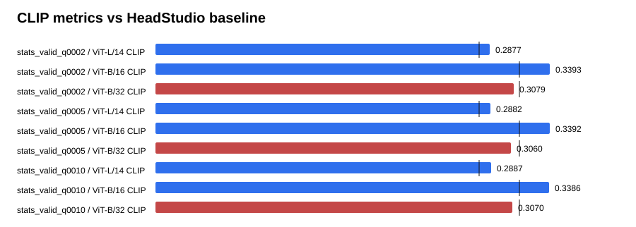

# Text-GS Alignment Dashboard

Baseline is the supplied HeadStudio table. CLIP and MUSIQ are higher-is-better; PIQE is lower-is-better.

## stats_valid_q0002

| Metric | Value | Baseline | Delta | Improved |
| --- | ---: | ---: | ---: | :---: |
| ViT-L/14 CLIP | 0.287690 | 0.278400 | 0.009290 | yes |
| ViT-B/16 CLIP | 0.339301 | 0.313000 | 0.026301 | yes |
| ViT-B/32 CLIP | 0.307942 | 0.313100 | -0.005158 | no |
| PIQE | 62.258521 | 59.930000 | 2.328521 | no |
| MUSIQ | 53.715999 | 51.360000 | 2.355999 | yes |

## stats_valid_q0005

| Metric | Value | Baseline | Delta | Improved |
| --- | ---: | ---: | ---: | :---: |
| ViT-L/14 CLIP | 0.288221 | 0.278400 | 0.009821 | yes |
| ViT-B/16 CLIP | 0.339197 | 0.313000 | 0.026197 | yes |
| ViT-B/32 CLIP | 0.305951 | 0.313100 | -0.007149 | no |
| PIQE | 61.579051 | 59.930000 | 1.649051 | no |
| MUSIQ | 54.919176 | 51.360000 | 3.559176 | yes |

## stats_valid_q0010

| Metric | Value | Baseline | Delta | Improved |
| --- | ---: | ---: | ---: | :---: |
| ViT-L/14 CLIP | 0.288694 | 0.278400 | 0.010294 | yes |
| ViT-B/16 CLIP | 0.338580 | 0.313000 | 0.025580 | yes |
| ViT-B/32 CLIP | 0.306951 | 0.313100 | -0.006149 | no |
| PIQE | 63.995110 | 59.930000 | 4.065110 | no |
| MUSIQ | 52.671350 | 51.360000 | 1.311350 | yes |

## Sources

- `outputs/text_gs_b32_stats_valid_sweep_v8_20260830/stats_valid_q0002/eval/all_metrics/summary.json`
- `outputs/text_gs_b32_stats_valid_sweep_v8_20260830/stats_valid_q0005/eval/all_metrics/summary.json`
- `outputs/text_gs_b32_stats_valid_sweep_v8_20260830/stats_valid_q0010/eval/all_metrics/summary.json`
