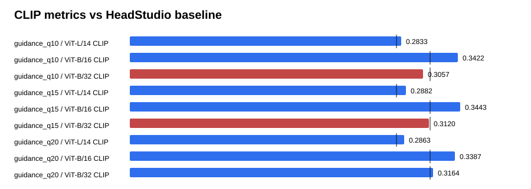

# Text-GS Alignment Dashboard

Baseline is the supplied HeadStudio table. CLIP and MUSIQ are higher-is-better; PIQE is lower-is-better.

## guidance_q10

| Metric | Value | Baseline | Delta | Improved |
| --- | ---: | ---: | ---: | :---: |
| ViT-L/14 CLIP | 0.283251 | 0.278400 | 0.004851 | yes |
| ViT-B/16 CLIP | 0.342207 | 0.313000 | 0.029207 | yes |
| ViT-B/32 CLIP | 0.305713 | 0.313100 | -0.007387 | no |
| PIQE | 62.375967 | 59.930000 | 2.445967 | no |
| MUSIQ | 55.846929 | 51.360000 | 4.486929 | yes |

## guidance_q15

| Metric | Value | Baseline | Delta | Improved |
| --- | ---: | ---: | ---: | :---: |
| ViT-L/14 CLIP | 0.288240 | 0.278400 | 0.009840 | yes |
| ViT-B/16 CLIP | 0.344256 | 0.313000 | 0.031256 | yes |
| ViT-B/32 CLIP | 0.312016 | 0.313100 | -0.001084 | no |
| PIQE | 63.135094 | 59.930000 | 3.205094 | no |
| MUSIQ | 55.427759 | 51.360000 | 4.067759 | yes |

## guidance_q20

| Metric | Value | Baseline | Delta | Improved |
| --- | ---: | ---: | ---: | :---: |
| ViT-L/14 CLIP | 0.286276 | 0.278400 | 0.007876 | yes |
| ViT-B/16 CLIP | 0.338737 | 0.313000 | 0.025737 | yes |
| ViT-B/32 CLIP | 0.316393 | 0.313100 | 0.003293 | yes |
| PIQE | 61.450295 | 59.930000 | 1.520295 | no |
| MUSIQ | 55.599418 | 51.360000 | 4.239418 | yes |

## Sources

- `outputs/text_gs_guidance_quality_sweep_20260830/guidance_q10/eval/all_metrics/summary.json`
- `outputs/text_gs_guidance_quality_sweep_20260830/guidance_q15/eval/all_metrics/summary.json`
- `outputs/text_gs_guidance_quality_sweep_20260830/guidance_q20/eval/all_metrics/summary.json`
