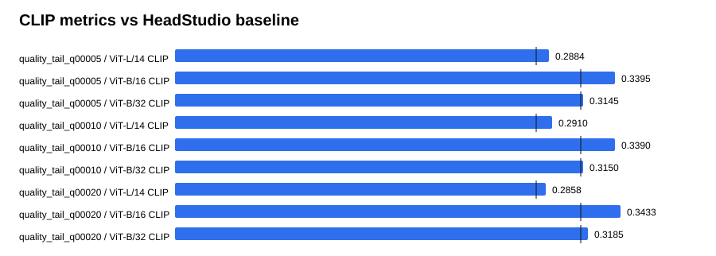

# Text-GS Alignment Dashboard

Baseline is the supplied HeadStudio table. CLIP and MUSIQ are higher-is-better; PIQE is lower-is-better.

## quality_tail_q00005

| Metric | Value | Baseline | Delta | Improved |
| --- | ---: | ---: | ---: | :---: |
| ViT-L/14 CLIP | 0.288396 | 0.278400 | 0.009996 | yes |
| ViT-B/16 CLIP | 0.339480 | 0.313000 | 0.026480 | yes |
| ViT-B/32 CLIP | 0.314498 | 0.313100 | 0.001398 | yes |
| PIQE | 61.624846 | 59.930000 | 1.694846 | no |
| MUSIQ | 54.620480 | 51.360000 | 3.260480 | yes |

## quality_tail_q00010

| Metric | Value | Baseline | Delta | Improved |
| --- | ---: | ---: | ---: | :---: |
| ViT-L/14 CLIP | 0.291027 | 0.278400 | 0.012627 | yes |
| ViT-B/16 CLIP | 0.338978 | 0.313000 | 0.025978 | yes |
| ViT-B/32 CLIP | 0.314965 | 0.313100 | 0.001865 | yes |
| PIQE | 62.345568 | 59.930000 | 2.415568 | no |
| MUSIQ | 55.010646 | 51.360000 | 3.650646 | yes |

## quality_tail_q00020

| Metric | Value | Baseline | Delta | Improved |
| --- | ---: | ---: | ---: | :---: |
| ViT-L/14 CLIP | 0.285769 | 0.278400 | 0.007369 | yes |
| ViT-B/16 CLIP | 0.343267 | 0.313000 | 0.030267 | yes |
| ViT-B/32 CLIP | 0.318491 | 0.313100 | 0.005391 | yes |
| PIQE | 61.748085 | 59.930000 | 1.818085 | no |
| MUSIQ | 55.010831 | 51.360000 | 3.650831 | yes |

## Sources

- `outputs/text_gs_quality_tail_q20_20260830/quality_tail_q00005/eval/all_metrics/summary.json`
- `outputs/text_gs_quality_tail_q20_20260830/quality_tail_q00010/eval/all_metrics/summary.json`
- `outputs/text_gs_quality_tail_q20_20260830/quality_tail_q00020/eval/all_metrics/summary.json`
