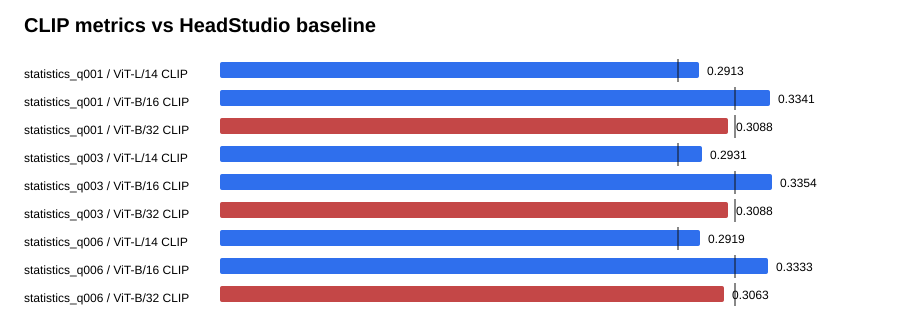

# Text-GS Alignment Dashboard

Baseline is the supplied HeadStudio table. CLIP and MUSIQ are higher-is-better; PIQE is lower-is-better.

## statistics_q001

| Metric | Value | Baseline | Delta | Improved |
| --- | ---: | ---: | ---: | :---: |
| ViT-L/14 CLIP | 0.291274 | 0.278400 | 0.012874 | yes |
| ViT-B/16 CLIP | 0.334073 | 0.313000 | 0.021073 | yes |
| ViT-B/32 CLIP | 0.308791 | 0.313100 | -0.004309 | no |
| PIQE | 61.278472 | 59.930000 | 1.348472 | no |
| MUSIQ | 54.062219 | 51.360000 | 2.702219 | yes |

## statistics_q003

| Metric | Value | Baseline | Delta | Improved |
| --- | ---: | ---: | ---: | :---: |
| ViT-L/14 CLIP | 0.293071 | 0.278400 | 0.014671 | yes |
| ViT-B/16 CLIP | 0.335430 | 0.313000 | 0.022430 | yes |
| ViT-B/32 CLIP | 0.308760 | 0.313100 | -0.004340 | no |
| PIQE | 63.370208 | 59.930000 | 3.440208 | no |
| MUSIQ | 54.366879 | 51.360000 | 3.006879 | yes |

## statistics_q006

| Metric | Value | Baseline | Delta | Improved |
| --- | ---: | ---: | ---: | :---: |
| ViT-L/14 CLIP | 0.291877 | 0.278400 | 0.013477 | yes |
| ViT-B/16 CLIP | 0.333305 | 0.313000 | 0.020305 | yes |
| ViT-B/32 CLIP | 0.306259 | 0.313100 | -0.006841 | no |
| PIQE | 61.034154 | 59.930000 | 1.104154 | no |
| MUSIQ | 54.442806 | 51.360000 | 3.082806 | yes |

## Sources

- `outputs/text_gs_reference_statistics_sweep_20260830/statistics_q001/eval/all_metrics/summary.json`
- `outputs/text_gs_reference_statistics_sweep_20260830/statistics_q003/eval/all_metrics/summary.json`
- `outputs/text_gs_reference_statistics_sweep_20260830/statistics_q006/eval/all_metrics/summary.json`
