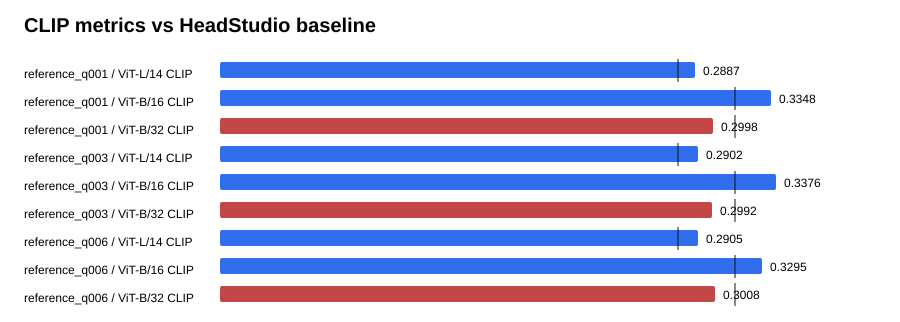

# Text-GS Alignment Dashboard

Baseline is the supplied HeadStudio table. CLIP and MUSIQ are higher-is-better; PIQE is lower-is-better.

## reference_q001

| Metric | Value | Baseline | Delta | Improved |
| --- | ---: | ---: | ---: | :---: |
| ViT-L/14 CLIP | 0.288734 | 0.278400 | 0.010334 | yes |
| ViT-B/16 CLIP | 0.334765 | 0.313000 | 0.021765 | yes |
| ViT-B/32 CLIP | 0.299832 | 0.313100 | -0.013268 | no |
| PIQE | 64.511250 | 59.930000 | 4.581250 | no |
| MUSIQ | 54.543825 | 51.360000 | 3.183825 | yes |

## reference_q003

| Metric | Value | Baseline | Delta | Improved |
| --- | ---: | ---: | ---: | :---: |
| ViT-L/14 CLIP | 0.290226 | 0.278400 | 0.011826 | yes |
| ViT-B/16 CLIP | 0.337575 | 0.313000 | 0.024575 | yes |
| ViT-B/32 CLIP | 0.299237 | 0.313100 | -0.013863 | no |
| PIQE | 63.448435 | 59.930000 | 3.518435 | no |
| MUSIQ | 54.117458 | 51.360000 | 2.757458 | yes |

## reference_q006

| Metric | Value | Baseline | Delta | Improved |
| --- | ---: | ---: | ---: | :---: |
| ViT-L/14 CLIP | 0.290524 | 0.278400 | 0.012124 | yes |
| ViT-B/16 CLIP | 0.329527 | 0.313000 | 0.016527 | yes |
| ViT-B/32 CLIP | 0.300779 | 0.313100 | -0.012321 | no |
| PIQE | 63.233809 | 59.930000 | 3.303809 | no |
| MUSIQ | 53.134557 | 51.360000 | 1.774557 | yes |

## Sources

- `outputs/text_gs_render_reference_sweep_20260830/reference_q001/eval/all_metrics/summary.json`
- `outputs/text_gs_render_reference_sweep_20260830/reference_q003/eval/all_metrics/summary.json`
- `outputs/text_gs_render_reference_sweep_20260830/reference_q006/eval/all_metrics/summary.json`
